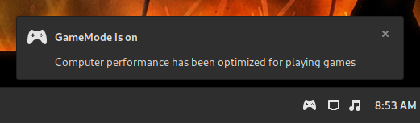

# Cinnamon GameMode Indicator
An applet that provides notifications about GameMode status and number of active clients



## Requirements

```bash
sudo apt install gamemode
```
## Usage
- Run the install.sh script
- Right click on the panel and select Applets
- Add the Appletto the panel by selecting it and clicking on the bottom + button

Note: You should restart Cinnamon after enabling this applet
